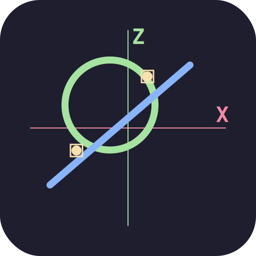

# SKICA – CAD pro CNC soustružník

<div align="center">
  
  <br/>
  <strong>Verze 1.7.0</strong>
</div>

---

## O projektu

**SKICA** je samostatná PWA aplikace pro návrh soustružnických dílů a generování NC programů pro obrábění na soustruhu. Aplikace běží plně v prohlížeči jako **client-side SPA** (žádný backend), offline-first, s podporou mobilních zařízení.

Aplikace je určena především pro obrábění na CNC soustruzích s řídicím systémem **Siemens Sinumerik 840D sl**.

---

## Klíčové funkce

### 2D CAD
- Kreslení primitiv: `LINE`, `ARC`, `CIRCLE`, `RECT`, `POLYLINE`, `TEXT`
- Pokročilé úpravy: `FILLET`, `CHAMFER`, `TRIM`, `EXTEND`, `BREAK`, `MOVE`, `COPY`, `ROTATE`, `SCALE`, `MIRROR`, `ARRAY`, `ARRAY CIRCULAR`
- Boolean operace, geometrické pomocné konstrukce, MERGE
- Základní **DXF import/export** s podporou 2D prvků, insertů, bloků, základní 3D face
- Automatické výpočty průsečíků a asociativní dimenze

### Soustružnické generátory
- **Zubové kola** – Cylindrická a kuželová (zobáčková) ozubení
- **Drážky** – DIN 374 / VDI prstové drážky
- **Závity** – metrické, technologické (formy A, B, C), válcové a kuželové

### CAM / G-kódy
- Generování **NC programu pro Sinumerik 840D sl**
- Výsekové strategie: čárový a kličkový výsekový rour,
   koncentrické obrysy, vrtací cykly
- Simulátor CAM strategií (náhled obrysů obrábění)
- Podpora přímočarých závitů a vrtání

### CNC Kalkulačky & Nástroje
- Mezní údaje, tolerance, práce s nástroji
- Výpočty **střihu**, otáček, dostupného zatížení, hmotnosti, zkrácení, prodlev
- Tabulky M-kódů, příkazy, přeskládání

### AI Panel
- Fotka strojírenského výkresu → analýza AI → soustružnický profil (Z/D)
- Konverze AI výstupu → kresba ve SKICA
- Podpora více AI poskytovatelů (Groq, Gemini, OpenRouter)

### Uživatelské rozhraní
- Černý / světlý režim (Catppuccin paleta)
- Plná podpora **mobilů** (touch ovládání, spodní lišta)
- Načtení/uložení projektu do %LOCALAPPDATA%, ukládání do IndexedDB
- Uložení obrázku PNG
- Neomezený UNDO/REDO
- In-app nápověda (CZ)

---

## Stack

| Vrstva          | Technologie                              |
|-----------------|------------------------------------------|
| Frontend        | Vanilla JS, ES modules (0 závislostí)    |
| Ukládání        | IndexedDB, localStorage                  |
| Offline         | PWA: Service Worker + Cache              |
| DXĚ import      | Custom DXF parser                        |
| Testování       | Vitest                                   |
| AI              | Groq / Gemini / OpenRouter API           |
| NC formát       | Sinumerik 840D / ISO 6983 (dialekt)      |
| UI paleta       | Catppuccin (dark + light theme)          |

---

## Lokální spuštění

```bash
git clone https://github.com/tvuj-user/2D_CAD-CAM.git
cd 2D_CAD-CAM

# stačí libovolný statický server (ES module = nelze file://)
npx serve .
# nebo
python -m http.server 8080
```

Poté otevři `http://localhost:PORT`.

### Generování service worker assetů (volitelné)
```bash
npm run sw
```

---

## Testování

```bash
npm test              # run all
npm run test:watch    # dev
npm run test:coverage # coverage
```

Testy jsou v `tests/` – unit i integrační (např. CAM g-code, DXF, gear).

---

## Struktura zdrojů (výber)

```
├── index.html          # PWA entry point, CSP, manifest
├── sw.js               # Service Worker (cache offline)
├── manifest.json       # PWA manifest
├── css/
│   └── style.css       # Catppuccin Mocha/Latte, ~5.5k ř.
├── js/
│   ├── state.js        # Stav aplikace, toast, undo/redo
│   ├── objects.js      # Správa výkresových objektů (CRUD)
│   ├── types.js        # Type definitions (registry, types)
│   ├── constants.js    # Barvy, počítadla
│   ├── canvas.js       # Canvas 2D rendering
│   ├── bridge.js       # AutoCenter, store
│   ├── geometry.js     # Geometrické operace (intersection, fillet, chamfer)
│   ├── dxf.js          # DXF import + export (1k+ řádek, SI format)
│   ├── cnc-calcs.js    # CNC kalkulačky: ohyby, otáčky, tolerance, ...
│   ├── toolLibrary.js  # Správa nástrojů
│   ├── stockTools.js   # Nástroje pro soustruh
│   ├── touch.js        # Touch ovládání
│   ├── ui.js           # UI, panely, tooltipy
│   ├── dialogs/        # Všechna dialogová okna (numerický input, M-code, gear, thread, ...)
│   ├── tools/          # Nástroje kreslení/úprav (line, arc, rect, polyline, gear, array, ...)
│   ├── calculators/    # CAM: gcode, threadData, roughness, cutting, tolerance, contour, ... 
│   └── ai/             # AI panel + settings (Multi-LLM)
├── tests/              # 30+ testovacích souborů
└── scripts/
    └── generate-sw-assets.js  # Generování assetů pro SW
```

---

## Architektura

- **Stav**: `state.objects` (`js/state.js`) sdílený objekt s `pushUndo()`/`performUndo()` (undostack).
- **Objekty**: pole `state.objects`, typy definované v `js/types.js`. Každý objekt má CSS-like vlastnosti (stroke, dash, color, vrsynt).
- **Render**: reaktivní překreslování canvasu po každé změně stavu.
- **Eventy**: handlery na canvasu + touch layer; nástroje jsou registry → vybráný tool registruje handlery.
- **CAM**: generátory v `js/calculators/` → vracejí strukturu kontur a obrábění.
- **Sinumerik**: výstup jako subprogramy + hlavičky dle předvoleb.

---

## Kontribuce

PR jsou vítány! Otevři issue, popiš změnu, ujisti se, že `npm test` prošel.

---

## Licence

ISC

---

## Stav projektu

| Verze   | Deník změn                          |
|---------|-------------------------------------|
| 1.7.0   | AI fotopanel, AI integrace           |
| 1.6.x   | Sinumerik subprogramy, opravy       |
| 1.5.x   | CAM strategie + finish only         |

(více viz git log)
